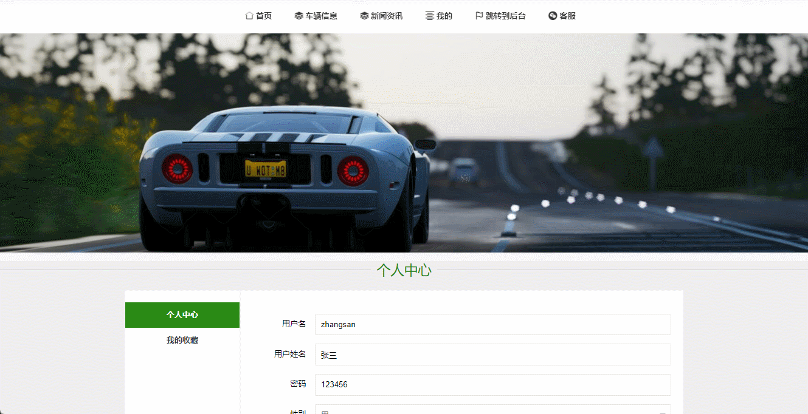
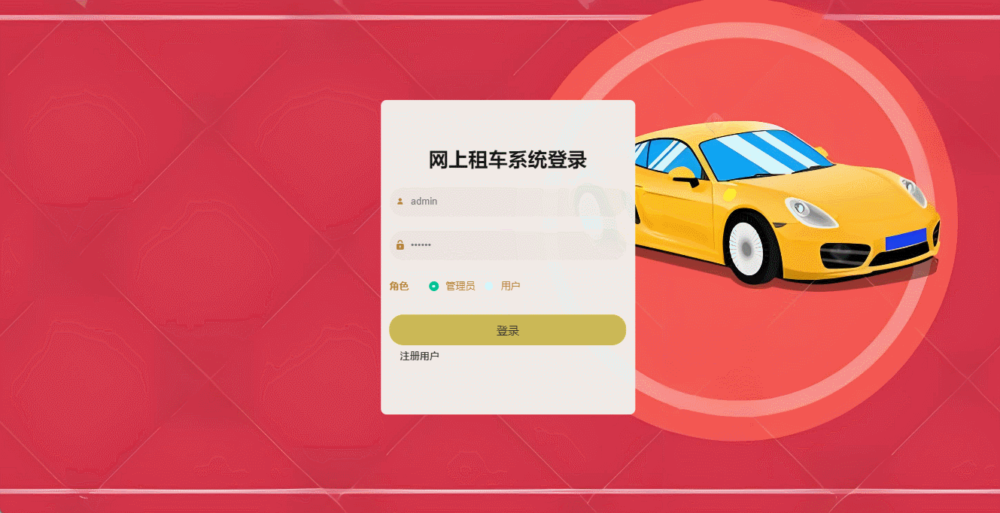

# car-rental🎂

基于SSM + Vue的租车平台

## 介绍🌞

> 在管理员界面具有个人中心、用户信息管理、车辆类型管理、租车信息管理、还车信息管理、评价信息管理、故障上报处理和系统管理功能。在用户界面，可以在个人中心当中修改自己的基本信息、查看想要租赁的车辆信息、进行还车操作、对已经完成的订单进行评价、上报车辆故障和对有意向的车辆进行收藏。

## 项目演示🌞

> 用户端





> 管理端



## 安装教程🌞

```
1. 运行环境准备mysql8 + java8 + node14.16.1

2. 配置maven路径，加载依赖

3. 运行sql文件，确保application.yml或config.properties的数据库名称和账号密码是数据库所在主机的账号密码
```


## 使用说明🌞

```
1. 登入

	管理员账号：admin	密码：123456

	客户账号：zhangsan	密码：123456
  
2. 运行流程

SpringBoot+Vue项目的部署详情可以查看这篇CSDN博客：http://t.csdnimg.cn/kpuxS

前后端不分离项目的部署流程可以查看这篇CSDN博客：http://t.csdnimg.cn/CslA5
```


## CSDN项目合集🌞

点击前往：http://t.csdnimg.cn/Q4u84


## 联系我🌞

**有偿获取完整源码或调试代码**

🐧：1902317191

微信：


